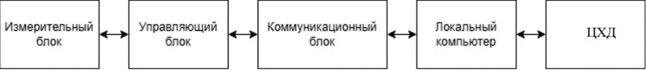
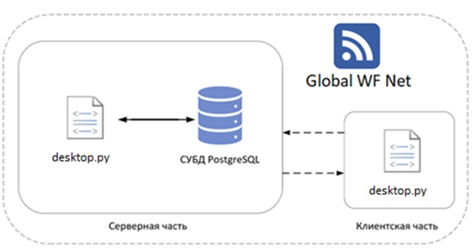

# **ТЗ Лидар**

## **Общие сведения**

### Полное наименование АС и ее условное обозначение

Система сбора и визуализации данных, работающая с датчиком лазерного сканирования LiDAR.

### Наименование организации-заказчика АС

НИЯУ МИФИ

### Наименование организации-разработчика

Студенты направления 09.04.02 Китаев С.М., Сальников А.Н, Свириденко Д.К., Ханалиев Р.В.

## **Цели и назначение создания автоматизированной системы**

### Цели создания АС

Целью проекта является создание низкобюджетного функционального инструментария для трёхмерного лазерного сканирования.

### Назначение АС

1. По сигналу с компьютера необходимо произвести серию измерений (расстояния до ближайших препятствий) с помощью ЛИДАР-датчика.
2. Собранные датчиком данные необходимо передать на компьютер.
3. Должны быть зафиксированы значения найденных расстояний и углов для каждого измерения, а также информация о месте проведения работ.
4. Отсканированное пространство (объекта) необходимо визуализировать в виде карты окружающей среды.

## **Характеристика объекта автоматизации**

### Общий вид АС и составных компонентов

АС состоит из следующих компонентов:
- Измерительный блок
- Управляющий блок
- Коммуникационный блок
- Блок питания
- Локальный компьютер
- ЦХД

Схема АС представлена на рисунке 3.1:

### Измерительный блок
Измерительный блок включает:
- Датчик RPLidar A1M8
- Микрокомпьютер Raspberry Pi B3+
- Коммуникационный кабель

Схема измерительного блока:  

### Управляющий блок
> Управляющий блок включает:
- Двигатель Nema 23 HS 8603
- Драйвер MicrostepDriver
- Микрокомпьютер Raspberry Pi B3+

### Коммуникационный блок
> Коммуникационный блок на базе Local WF Net включает:
- Микрокомпьютер Raspberry Pi B3+
- Локальный ПК

### Блок питания
Состав блока питания:
- USB-адаптер Laptop Universal Adapter
- Источник питания 10s2p на 4400 mAh
- Понижающий преобразователь DC-DC 5A XL4005

### Локальный компьютер
Программные блоки:
- `desktop.py` - веб-интерфейс
- `check_connection_to_lidar.py` - проверка соединения
- `start.py` - запуск сканирования
- `data_transform.py` - преобразование координат
- `data_check.py` - проверка данных
- `app2.py` - работа с БД

### ЦХД
Центр обработки данных включает:
- Сервер с БД
- Сервис для взаимодействия с БД

### Общий вид обращения данных АС

## **Требования к автоматизированной системе**
Полный перечень требований к системе доступен в документе:  
[ТЗ Лидар (версия от 22.03.25).md](ТЗ%20Лидар(версия%20от%2022.03.25).md)

## **Состав и содержание работ по созданию АС**

### Таблица 5.1 - Календарный план для команды разработки веб-интерфейса

| Стадия разработки                     | Крайний срок выполнения |
|---------------------------------------|-------------------------|
| Написание ТЗ и концепции проекта      | 29.01.25                |
| Изучение унаследованной системы       | 16.02.25                |
| Редактирование календарного плана     | 29.02.25                |
| Анализ архитектуры                    | 09.03.25                |
| Разработка концепции веб-интерфейса   | 16.03.25                |
| Выбор технологий                      | 25.03.25                |
| Получение необходимых навыков         | 01.04.25                |
| Разработка макетов и дизайн           | 10.04.25                |
| Разработка фронтенда                  | 26.04.25                |
| Функциональное тестирование           | 19.05.25                |
| Исправление ошибок и отладка          | 25.05.25                |

### Таблица 5.2 - Календарный план для команды интеграции с ЦХД

| Стадия разработки                     | Крайний срок выполнения |
|---------------------------------------|-------------------------|
| Написание ТЗ и концепции проекта      | 29.01.25                |
| Изучение унаследованной системы       | 16.02.25                |
| Редактирование календарного плана     | 29.02.25                |
| Анализ архитектуры                    | 09.03.25                |
| Выбор технологий                      | 16.03.25                |
| Получение необходимых навыков         | 01.04.25                |
| Разработка API для взаимодействия с ЦХД | 05.05.25              |
| Тестирование API и интеграция         | 19.05.25                |
| Функциональное тестирование           | 19.05.25                |
| Исправление ошибок и отладка          | 25.05.25                |

## **Порядок разработки документации**

### Перечень документов и исходных данных

1. RPLIDAR A1. Low Cost 360 Degree Laser Range Scanner. Introduction and Datasheet (2016)
2. ГОСТ 34.602-2020
3. Курсовой проект Екимовской В.А. и др. (2023)
4. Пояснительная записка Мочкина К.А. (2022)
5. ТЗ ЛИДАР - Приваленко А.А., Чернова М.П. (2023)
6. Концептуальный проект ЛИДАР - Приваленко А.А., Чернова М.П. (2023)

### Перечень документов для защиты

1. Схема связи компонентов системы
2. Схема программного кода
3. Схема экспериментов и тестирования
4. Характеристика системы

## **Порядок проведения защиты проекта**

1. Экспертиза всех документов из п. 7.2
2. Экспертиза дополнительных документов
3. Подготовка демонстрационной установки
4. Подготовка презентации